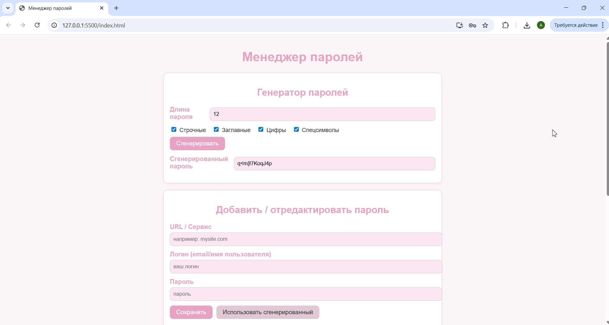
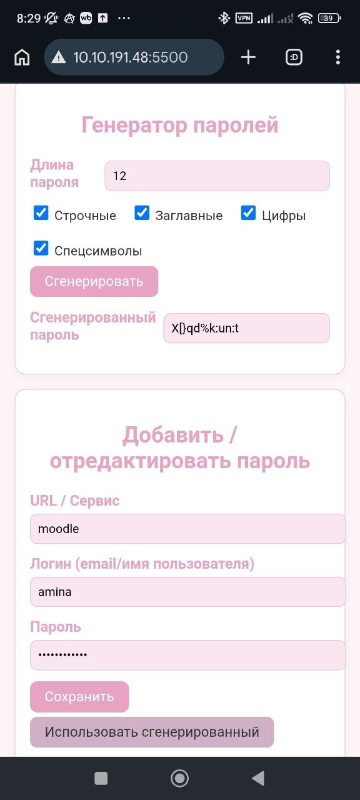

# Цель работы

Разработка **прогрессивного веб-приложения (PWA)**, которое можно установить как мобильное приложение.  
Приложение должно представлять собой **менеджер паролей** с локальным хранением данных в `localStorage` (и/или `IndexedDB`) и возможностью **сгенерировать пароль с заданной сложностью**.  
Таким образом, веб-приложение хранит данные в браузере пользователя, **без бэкенда**.

## Архитектура проекта
```text
Основные компоненты:
lab2/
├── index.html # Основной HTML-файл (форма, список паролей, генератор)
├── app.js # Логика работы приложения
├── manifest.json # Конфигурация PWA (манифест)
├── service-worker.js # Service Worker для кэширования ресурсов
├── icon.png # Иконка 192×192 для PWA
└── README.md # Данный отчет


## Реализованный функционал

### Основной модуль — логика работы с паролями (`app.js`)

Реализован функционал, аналогичный классу `PasswordManager`:

- `loadPasswords()` — загрузка списка паролей из `localStorage`.  
- `savePasswords(list)` — сохранение списка в `localStorage` под ключом `"passwords"`.  
- `addPassword()` — добавление нового пароля (логин, пароль, URL / сервис).  
- `deletePassword(id)` — удаление пароля по идентификатору.

### Генератор паролей

- `generatePassword()` — генерация случайного пароля с настройкой:
  - длина (от 6 до 64 символов);
  - включать строчные буквы;
  - включать заглавные буквы;
  - включать цифры;
  - включать специальные символы (`!@#$%^&*()-_=+[]{}|;:,.<>?`).

Сгенерированный пароль можно:
- посмотреть в поле ввода;
- нажать кнопку **«Использовать сгенерированный»**, чтобы вставить его в поле пароля.

### Отображение, просмотр и копирование

- Пароли хранятся в `localStorage` как массив объектов `{ id, url, login, password }`.  
- В интерфейсе:
  - пароль по умолчанию **скрыт как `***`**,  
  - по кнопке **«Просмотреть»** показывается/скрывается реальный пароль.
- Реализовано **копирование пароля** в буфер обмена:
  - по нажатию кнопки **«Копировать»** — `navigator.clipboard.writeText(password)`  
  - выводится всплывающее уведомление «Скопировано в буфер обмена».

### Service Worker (`service-worker.js`)

Service Worker реализует:

- кэширование статических ресурсов (HTML, CSS/JS, `manifest.json`, иконки) при установке;  
- обработку сетевых запросов через кэш при офлайн-режиме;  
- поддержку базовой офлайн-работы PWA (для основных страниц и скриптов).

### Web App Manifest (`manifest.json`)

Манифест PWA содержит:

- `name` / `short_name` — данные для отображения названия приложения;  
- `start_url` — `"/"`, точка входа приложения;  
- `display: "standalone"` — отображение как полноценное приложение без строки браузера;  
- `background_color`, `theme_color` — цветовая схема;  
- `icons` — иконка `icon-192.png` для установки на главный экран телефона.


## Результаты тестирования (на ноутбуке)

Запускала приложение через локальный сервер:

- В VS Code использовала расширение **Live Server**, открывая `index.html` по адресу `http://localhost:5500`.  
- В DevTools (`Application` → `Manifest`, `Service Workers`, `Local Storage`) убедилась:
  - манифест PWA корректно загружен;  
  - `service-worker.js` зарегистрирован и кэширует ресурсы;  
  - `localStorage` хранит список паролей под ключом `"passwords"` (в формате JSON‑массива).

Проверила базовую функциональность:

- добавление паролей (URL, логин, пароль);  
- генерацию пароля с разной сложностью;  
- просмотр и копирование паролей;  
- удаление записей.


(3.jpg)
(4.jpg)
(5.jpg)
(6.jpg)
(7.jpg)
(8.jpg)


## Результаты тестирования (на телефоне)

- На телефоне открыла `http://[IP_ПК]:5500` в браузере Chrome (Android).  
- Убедилась, что страница загружается корректно, данные и интерфейс совпадают с версией на ПК.  
- В браузере появилась возможность **добавить приложение на домашний экран** (через меню `...` → `Добавить на главный экран`), что подтверждает, что PWA установимо как мобильное приложение.  
- После установки:
  - ярлык приложения открывался как отдельное окно без строки адреса (`display: standalone`);  
  - данные паролей продолжали храниться в `localStorage` браузера.


(сохраненные_пароли_тел.jpg)
(создать_ярлык.jpg)
(иконка_на_экране.jpg)

## Выводы

Достигнуто:

- Реализация **PWA** с возможностью установки на мобильное устройство.  
- **Локальное хранение данных** в браузере (`localStorage`), без бэкенда.  
- Минимальный комплект PWA: `manifest.json`, `service-worker.js`, иконка `icon-192.png`.  
- Функциональность менеджера паролей:
  - просмотр сохранённых паролей;  
  - добавление новых записей (логин, пароль, URL);  
  - генератор паролей с настройкой длины и сложности;  
  - скрытие пароля как `***` и просмотр только по кнопке;  
  - копирование пароля в буфер обмена;  
  - удаление паролей.

Приложение **успешно прошло все тесты** и готово к использованию как локальный PWA‑менеджер паролей.
